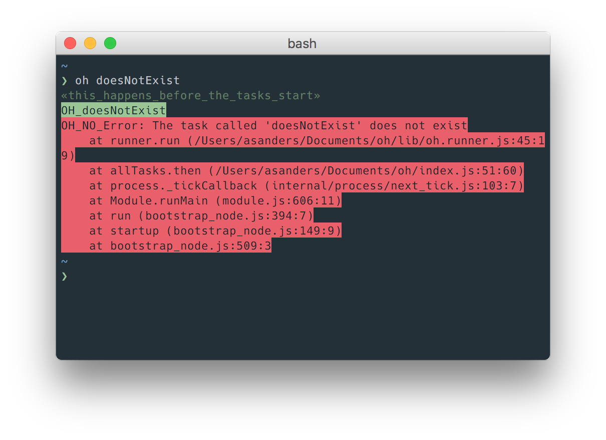

# `oh`

In-development PoC of a tiny, development and CI-friendly task-runner.

### To do
- [ ] accept task names as input `oh x` etc and make all flags available to tasks
- [ ] add quiet mode (no task logging except errors)
- [x] show that tasks are subtasks in the terminal
- [ ] autocomplete task names
- [ ] tests!
- [x] parallel tasks
- [ ] allow multiple manifests (`oh.compile.js` => `oh compile.css`, `oh.test.js` => `oh test.app`)
- [ ] a way to specify where to find manifests

## Features

- verbose by default
- fails visibly then kills itself
- small, simple API




## Why?

- **make** really just wants to make things, and can be too restrictive e.g. it's hard to pass args or use modules from npm
- **npm scripts** can be too terse
- **gulp**/**grunt** et al are hefty and often rely on 3rd party plugins

## Usage
`oh` will look for a task manifest called `oh.js`, for example this one:

```javascript
// oh.js

module.exports = { 
    OH_before() {
        this.log('this happens before the tasks start');
    },
    
    default() {
        log("I'm going to run the `runABandCinParallel` task");
        run('runABandCinParallel');
    },

    runABandCinParallel() {
        run(['a', 'b', 'c']);
    },

    a: () => exec('ls -l'),
    b: () => exec('ls -a'),
    c: () => exec('ls -G'),

    OH_after() {
        this.log('this happens after the tasks end');
    }
};

```
Now you can run `oh` (run the default task, if defined), or `oh runABandCinParallel`, `oh a` etc.

## API
Any function that you `export` from `oh.js` becomes a task.

`oh` provides the following helpers for use in an `oh.js`:

### log(String)
Tell yourself something about whats going on.

### run(String|Array)
Run other tasks defined in `oh.js`. An array of task names will run in parallel.

Returns a promise that resolves once the task(s) completes.

### exec(String)
Executes a string as a terminal command, using local binaries if they're available (like `npm` scripts).

Returns a promise that resolves once the command completes.

## Built-in tasks

Two optional setup/teardown-style tasks are available:

### OH_before(function)
Do something before the tasks start e.g. check the version of node your running in, `npm i` etc.

### OH_after(function)
Do something after the tasks end e.g. clean up artefacts, restore previous state etc.


## Development
- `yarn install`
- `yarn link` to add the local binary to your path (you need `yarn@^0.19.0` for `link` to work)
- only tried with Node 6 so far

### Files
- `index.js` the task runner
- `oh` the binary that points at `index.js`
- `oh.js` task manifest – this is the file you'd expect to see in a project root

