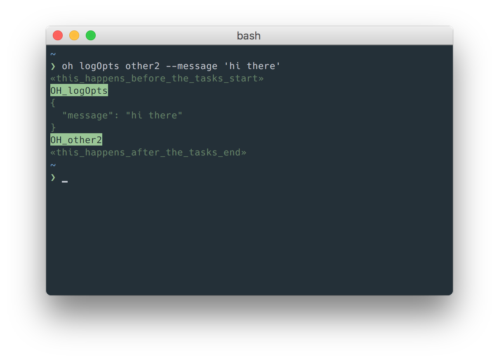

# `oh`

In-development PoC of a tiny, development and CI-friendly task-runner.

### To do
- [x] accept task names as input `oh x` etc
- [x] make all flags available to tasks
- [ ] add quiet mode (no task logging except errors)
- [x] show that tasks are subtasks in the terminal
- [ ] autocomplete task names
- [ ] tests!
- [x] parallel tasks
- [ ] allow multiple manifests (`oh.compile.js` => `oh compile.css`, `oh.test.js` => `oh test.app`)
- [ ] a way to specify where to find manifests

## Features

- verbose by default
- fails visibly then kills itself
- small, simple API




## Why?

- **make** really just wants to make things, and can be too restrictive e.g. it's hard to pass args or use modules from npm
- **npm scripts** can be too terse
- **gulp**/**grunt** et al are hefty and often rely on 3rd party plugins

## Usage
`oh` will look for a task manifest called `oh.js`, for example this one:

```javascript
// oh.js

module.exports = {
    __before() {
        this.log('this happens before the tasks start');
    },

    main() {
        return this.run('logOpts').then(() => this.run('other'));
    },

    other() {
        return this.run(['other2', 'ls']).then(() => this.log('ran others'));
    },

    other2() {
        return new Promise(resolve => {
            setTimeout(resolve, 2000);
        });
    },

    ls() {
        return this.exec('ls');
    },

    logOpts() {
        this.log(this.args);
    },

    __after() {
        this.log('this happens after the tasks end');
    }
};

```
Now you can run `oh main`, `oh ls` etc.

You can also run multiple tasks e.g. `oh other other2`. They will run in series. 

You can supply arguments to your tasks too e.g `oh main --dev`, `oh logOpts --greeting 'hi there'` etc. They are available via `this.args`.

## API
Any function that you `export` from `oh.js` becomes a task.

`oh` provides the following helpers for use in a task:

### this.log(String)
Tell yourself something about whats going on.

### this.run(String|Array)
Run other tasks defined in `oh.js`. An array of task names will run in parallel.

Returns a promise that resolves once the task(s) completes.

### this.exec(String)
Executes a string as a terminal command, using local binaries if they're available (like `npm` scripts).

Returns a promise that resolves once the command completes.

### this.args
An object representing any options in the command, except `h`, `help`, `v` and `version`.

## Built-in tasks

Two optional setup/teardown-style tasks are available:

### this.__before(function)
Do something before the tasks start e.g. check the version of node your running in, `npm i` etc.

### this.__after(function)
Do something after the tasks end e.g. clean up artefacts, restore previous state etc.


## Development
- `yarn install`
- `yarn link` to add the local binary to your path (you need `yarn@^0.19.0` for `link` to work)
- only tried with Node 6 so far

### Files
- `oh.js` task manifest – this is the file you'd expect to see in a project root
- `index.js` the application that runs the tasks in `oh.js`
- `oh` the binary that points at `index.js`

